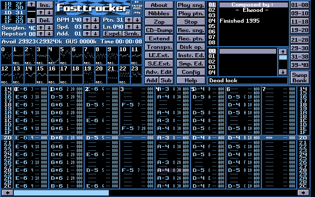

# AI Tracker

An experimental tool for human-AI musical collaboration.

The idea: a tracker-style pattern editor where you can discuss the song with an AI — not just describe it in words, but share the actual musical structure in a format both humans and AI can read at a glance. The AI receives the pattern, sample descriptions, tempo, and other context, and can suggest or make changes directly.

Intentionally minimalistic in both features and sound quality, built in the spirit of classic tracker programs.

*Fast Tracker 2 (1994) — A respected example to follow.*

