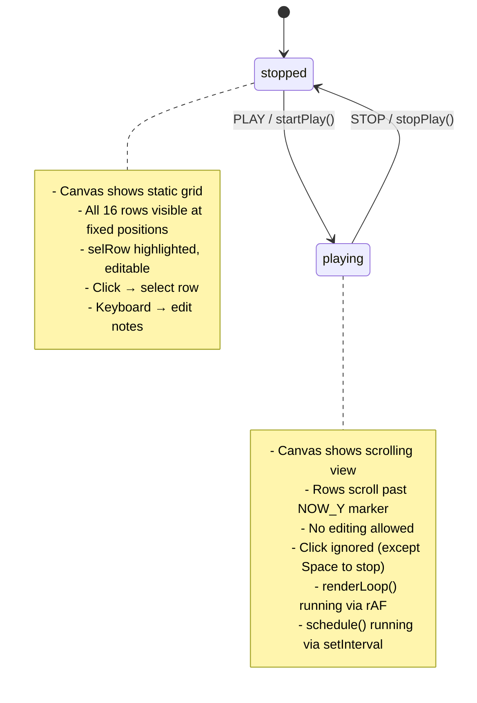
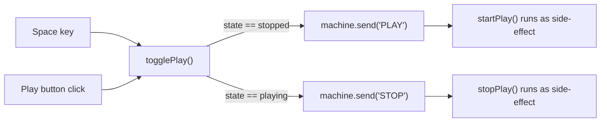

# Grid Editor — State Machine

The entire module is governed by a two-state FSM created via `createMachine()`.

## State Diagram

## Transition Triggers

## What Each Transition Does

### PLAY → `startPlay()`

1. Acquire `AudioContext` from parent
2. Set `songStart` = `currentTime + 0.05` (tiny offset to avoid scheduling in the past)
3. Set `loopStart` = `songStart`, `nextSchedRow` = 0
4. Clear `nodes[]`
5. Run `schedule()` once immediately
6. Start `setInterval(schedule, 25ms)` — the lookahead scheduler
7. Start `requestAnimationFrame(renderLoop)` — the visual scroll

### STOP → `stopPlay()`

1. `clearInterval(schedId)` — kill scheduler
2. `cancelAnimationFrame(rafId)` — kill render loop
3. Stop and disconnect every `{src, gain}` in `nodes[]`
4. Clear `nodes[]`

## State Guards in the Code

| Location | Check | Purpose |
|----------|-------|---------|
| `onCanvasClick` | `machine.getState() === "playing"` → return | No row selection during playback |
| `onKey` | `machine.getState() === "playing"` → return | No editing during playback (except Space) |
| `draw()` | `machine.getState() === "playing"` | Branch: `drawPlayingView()` vs `drawStoppedView()` |
| `togglePlay()` | `machine.getState() === "stopped"` | Decides which event to send |
