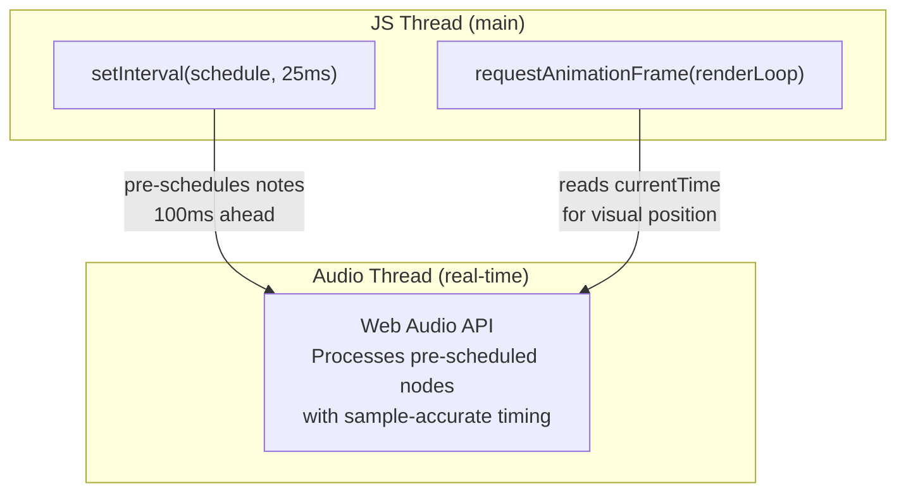
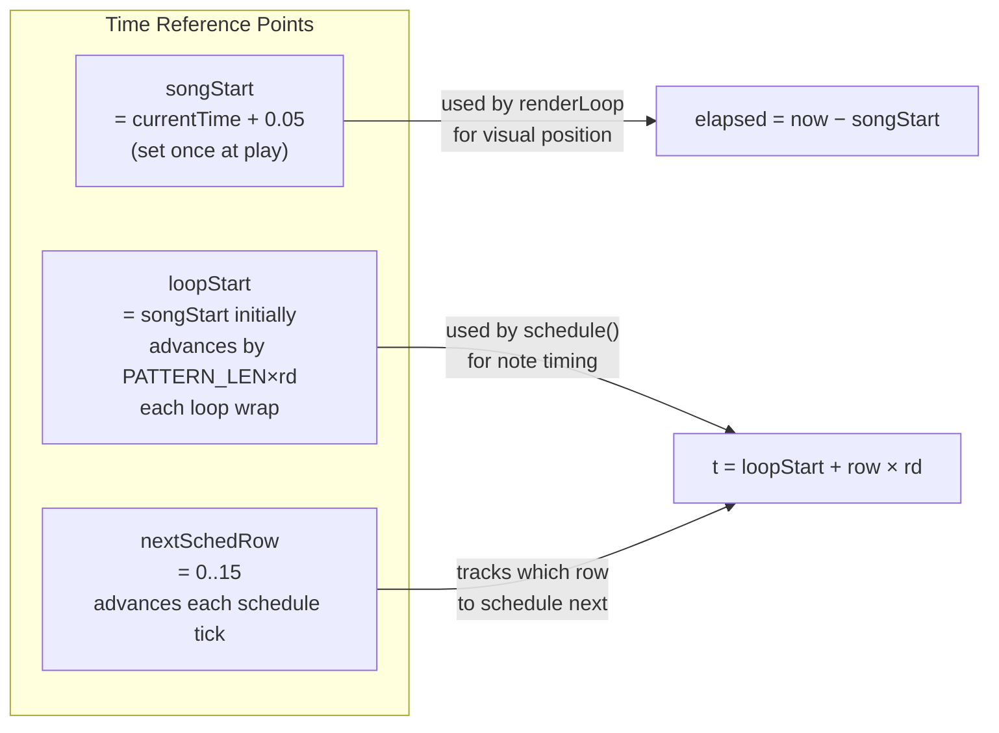
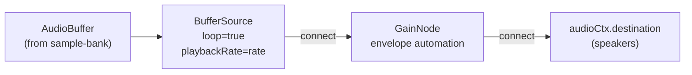
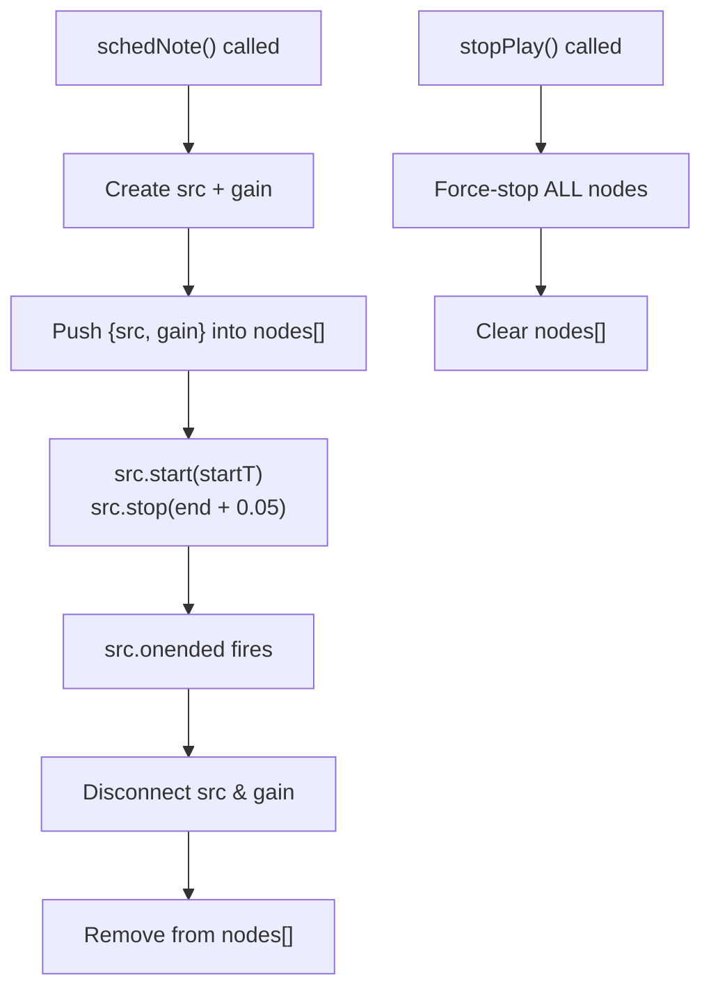

# Grid Editor — Audio Scheduling & Web Audio Graph

## The Lookahead Scheduler Pattern

This is the standard Web Audio "lookahead scheduler" pattern (Chris Wilson's technique). Two independent loops cooperate:



### Why Two Loops?

| Loop | Interval | Purpose | Thread |
|------|----------|---------|--------|
| `setInterval(schedule, 25ms)` | ~25ms | Schedule audio nodes into the future | JS main thread |
| `requestAnimationFrame(renderLoop)` | ~16ms | Update visual scroll position | JS main thread |

The **audio thread** executes the pre-scheduled nodes with sample-accurate precision. JS just needs to stay ahead by `LOOKAHEAD` seconds (100ms).

## Scheduler Timeline

```
 audioCtx.currentTime
 ──────────────────────────────────────────────────────→ time
        │                               │
        │←── already playing ──→│       │
        │                       │       │
        now                     │   horizon = now + 0.1s
                                │       │
                         nextSchedRow   │
                         starts here    │
                                        │
                    ┌───────────────────┐
                    │ schedule() scans  │
                    │ rows from         │
                    │ nextSchedRow,     │
                    │ calls schedNote() │
                    │ for each row with │
                    │ a note, until     │
                    │ t > horizon       │
                    └───────────────────┘
```

### schedule() Algorithm

```
function schedule():
    rd = rowDur()                         // seconds per row = 60/(bpm×4)
    horizon = audioCtx.currentTime + 0.1  // look 100ms ahead

    loop forever:
        t = loopStart + nextSchedRow × rd // absolute time of this row
        if t > horizon → break            // far enough ahead, stop

        if pattern[nextSchedRow] has note:
            schedNote(note, t, row, rd)   // create Web Audio nodes

        nextSchedRow++
        if nextSchedRow >= 16:            // pattern wraps
            nextSchedRow = 0
            loopStart += 16 × rd          // advance loop origin
```

### Timing Variables



## Note Duration Calculation

```
For a note at row R:
  Scan forward (wrapping): find next row with a note
  durRows = distance to next note (or PATTERN_LEN if none found)
  dur = durRows × rowDur()

Example (PATTERN_LEN=16):
  Row 0: C-4  ← durRows = 4 (next note at row 4)
  Row 4: E-4  ← durRows = 12 (next note at row 0, wrapping: 16-4=12)
  
  dur in seconds = durRows × 60/(bpm × 4)
  At 120 BPM:  rowDur = 60/480 = 0.125s
               4 rows = 0.5s, 12 rows = 1.5s
```

## Web Audio Node Graph (per note)



### Buffer Source Configuration

```
src.buffer     = getAudioBuffer(SAMPLE_ID, audioCtx)
src.loop       = true
src.loopStart  = sample.loopStart / sample.sampleRate   (seconds)
src.loopEnd    = sample.loopEnd / sample.sampleRate      (seconds)
src.playbackRate = calculatePlaybackRate(noteStr, sample.baseNote)
```

### Gain Envelope (anti-click)

```
 gain
 0.3 │         ┌─────────────────────────┐
     │        ╱│                         │╲
     │       ╱ │                         │ ╲
     │      ╱  │       sustain           │  ╲
 0.0 │─────╱───┴─────────────────────────┴───╲─────
     │  fade                                fade
     └──────────────────────────────────────────── time
     startT  +fade                    end-fade  end

 fade = min(0.01, dur × 0.1)

 Timeline:
   setValueAtTime(0, startT)
   linearRampToValueAtTime(0.3, startT + fade)    ← attack
   setValueAtTime(0.3, end - fade)                 ← sustain
   linearRampToValueAtTime(0, end)                 ← release
   src.stop(end + 0.05)                            ← tiny extra for fade tail
```

## Node Lifecycle



## Preview Note (editing blip)

Separate from the scheduler — triggered by keyboard input:

```
Duration: 250ms, Gain: 0.25 → 0 over 200ms
No scheduling — plays immediately at currentTime
Same sample/buffer/rate setup as scheduled notes
```
