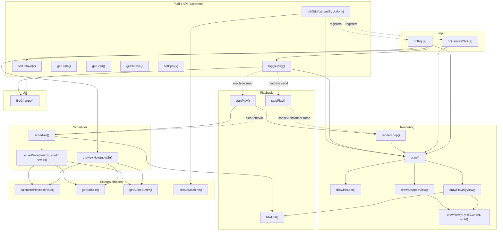
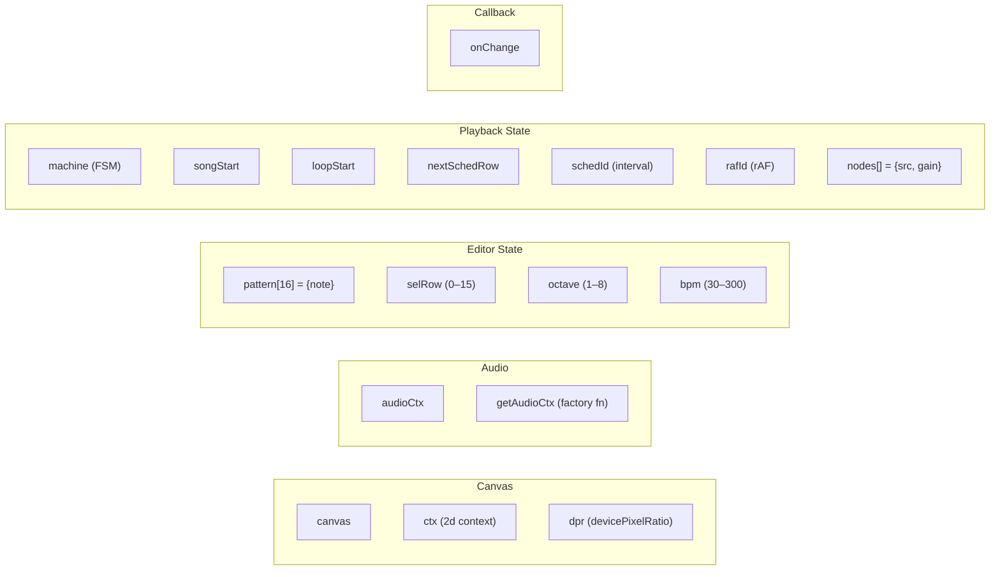
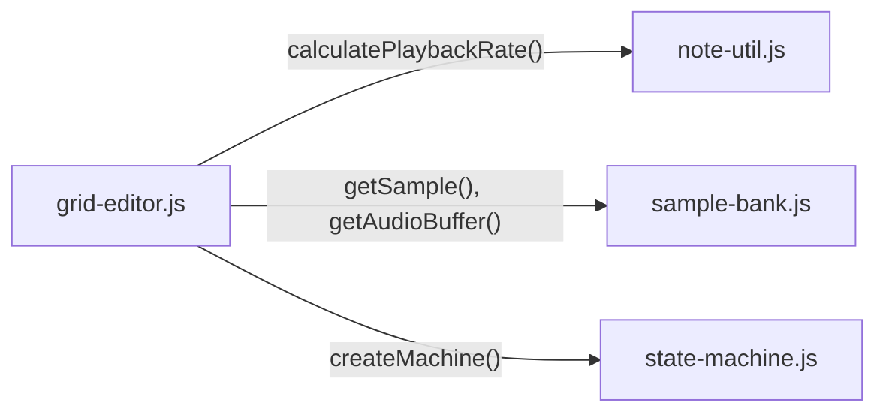

# Grid Editor — Function Call Graph

## Complete Call Graph

## Function Index

| Function | Type | Lines | Purpose |
|----------|------|-------|---------|
| `initGrid` | export | ~30 | Setup canvas, pattern, state machine, event listeners |
| `togglePlay` | export | ~4 | Send PLAY/STOP to state machine |
| `getState` | export | 1 | Return current FSM state |
| `getBpm` | export | 1 | Return BPM value |
| `getOctave` | export | 1 | Return current octave |
| `setBpm` | export | 1 | Clamp and set BPM (30–300) |
| `setOctave` | export | 1 | Clamp and set octave (1–8), fire change |
| `rowDur` | private | 1 | Calculate seconds per row: `60 / (bpm × 4)` |
| `startPlay` | private | ~10 | Init scheduler + render loop |
| `stopPlay` | private | ~10 | Tear down scheduler + render loop + audio nodes |
| `schedule` | private | ~15 | Lookahead: schedule notes within 100ms horizon |
| `schedNote` | private | ~40 | Create BufferSource + GainNode for one note |
| `previewNote` | private | ~20 | Play 250ms blip of a note (editing feedback) |
| `renderLoop` | private | 2 | rAF loop calling draw() |
| `draw` | private | ~5 | Clear canvas, header, branch to stopped/playing view |
| `drawHeader` | private | ~10 | Render "ROW" / "NOTE" header bar |
| `drawStoppedView` | private | ~3 | Render all 16 rows statically |
| `drawPlayingView` | private | ~20 | Render scrolling rows around now-marker |
| `drawRow` | private | ~30 | Render one row: bg, beat line, row#, divider, note, selection |
| `onCanvasClick` | private | ~10 | Click → acquire audio ctx, select row |
| `onKey` | private | ~40 | Keyboard dispatch: Space, arrows, delete, +/-, note keys |
| `fireChange` | private | 1 | Call external onChange callback |

## Module State Variables

## Dependency on External Modules

