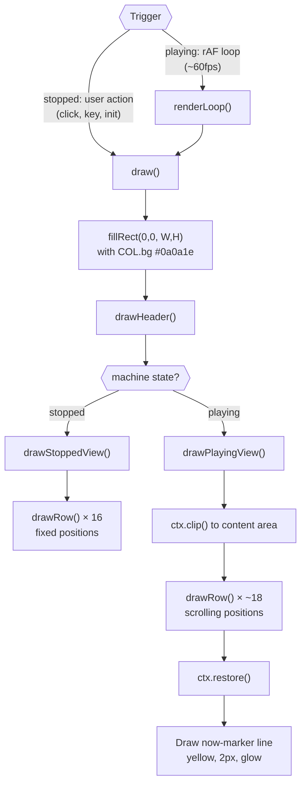
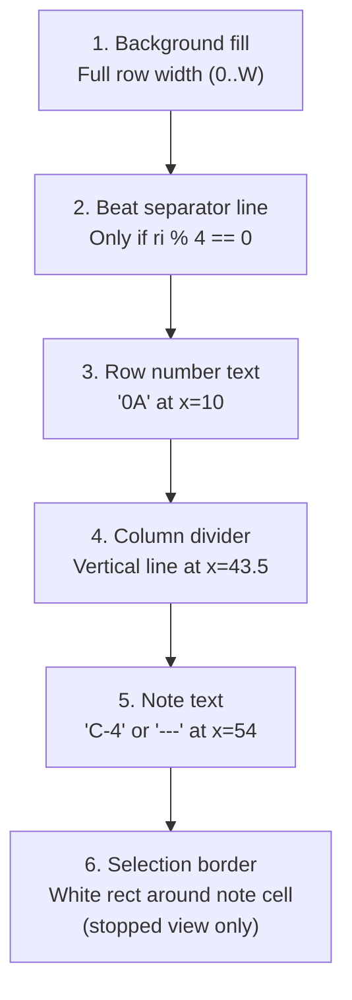
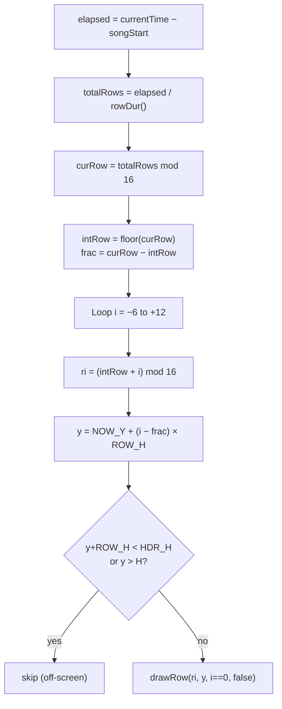

# Grid Editor — Render Pipeline

## Top-Level Render Flow



## drawRow() — Layer-by-Layer

Each row is painted in this exact order (later layers overdraw earlier ones):



### Layer Details

```
LAYER 1 — Background
┌──────────────────────────────────────────────────────┐
│  Priority: isCurrent > isSel > even/odd              │
│  isCurrent → COL.playRow (yellow tint, playing only) │
│  isSel     → COL.sel (white tint, stopped only)      │
│  even row  → COL.rowEven  #0c0c22                    │
│  odd row   → COL.rowOdd   #0a0a1c                    │
└──────────────────────────────────────────────────────┘

LAYER 2 — Beat separator (every 4 rows: 00, 04, 08, 0C)
───────────────────────────────────── full width, y+0.5
  COL.beatLn #2a2a44, 1px

LAYER 3 — Row number
  "0A"  at (10, y + ROW_H/2)
  Font: 12px monospace
  Color: COL.rowNumBt #777 (beat rows) / COL.rowNum #555 (other)

LAYER 4 — Column divider  
  Vertical line at x = ROW_NUM_W - 0.5 = 43.5
  COL.div #222, 1px

LAYER 5 — Note text
  "C-4" or "---"  at (CELL_X+10, y + ROW_H/2) = (54, ...)
  Font: 13px monospace
  Color: COL.note #00dd66 (has note) / COL.empty #333 (empty)

LAYER 6 — Selection border (only when isSel=true)
  strokeRect at (CELL_X+2, y+1.5, CELL_W-4, ROW_H-3)
  COL.selBdr #ffffff, 1.5px
```

## Stopped View vs Playing View

```
┌─────────────────────┬──────────────────────────────────┐
│   STOPPED VIEW      │   PLAYING VIEW                   │
├─────────────────────┼──────────────────────────────────┤
│ Trigger: user action│ Trigger: rAF loop (~60fps)       │
│ 16 rows, fixed pos  │ ~18 rows, scrolling              │
│ selRow highlighted   │ No selection                     │
│ No clip region       │ Clipped to HDR_H..H             │
│ No marker line       │ Yellow marker at NOW_Y=168       │
│ drawRow(i, y,        │ drawRow(ri, y,                   │
│   false, i==selRow)  │   i==0, false)                   │
│                      │ Sub-pixel scroll via frac        │
└─────────────────────┴──────────────────────────────────┘
```

## Playing View Scroll: Which Rows Are Visible?



### Concrete Example (intRow=3, frac=0.5)

```
 i   ri   y (px)           visible?
 -6   13   NOW_Y + (-6.5)×28 = -14      barely (clipped by header)
 -5   14   NOW_Y + (-5.5)×28 =  14      barely (clipped by header)
 -4   15   NOW_Y + (-4.5)×28 =  42      yes
 -3    0   NOW_Y + (-3.5)×28 =  70      yes
 -2    1   NOW_Y + (-2.5)×28 =  98      yes
 -1    2   NOW_Y + (-1.5)×28 = 126      yes
  0    3   NOW_Y + (-0.5)×28 = 154      yes ← CURRENT (playRow)
  1    4   NOW_Y + ( 0.5)×28 = 182      yes
  2    5   NOW_Y + ( 1.5)×28 = 210      yes
 ...
 10   13   NOW_Y + ( 9.5)×28 = 434      yes
 11   14   NOW_Y + (10.5)×28 = 462      yes
 12   15   NOW_Y + (11.5)×28 = 490      no (below H=476)
```

## Header Rendering

```
 ┌──────────────────────────────────────────────────────┐ y=0
 │  "ROW"          "NOTE"                               │
 │  at (8, 14)     at (54, 14)                          │
 │  COL.hdrBg #0f0f2a, COL.hdrTxt #888                 │
 │  font: bold 11px monospace                           │
 ├──────────────────────────────────────────────────────┤ y=27.5
   divider line (COL.div #222, 1px)                       y=28
```

## When Does draw() Get Called?

| Situation | Caller |
|-----------|--------|
| Module init | `initGrid()` → `draw()` |
| Row click (stopped) | `onCanvasClick()` → `draw()` |
| Note entered/deleted | `onKey()` → `draw()` |
| Arrow key navigation | `onKey()` → `draw()` |
| During playback | `renderLoop()` → `draw()` (~60fps via rAF) |
| Playback stops | `togglePlay()` → `draw()` (one final frame) |
