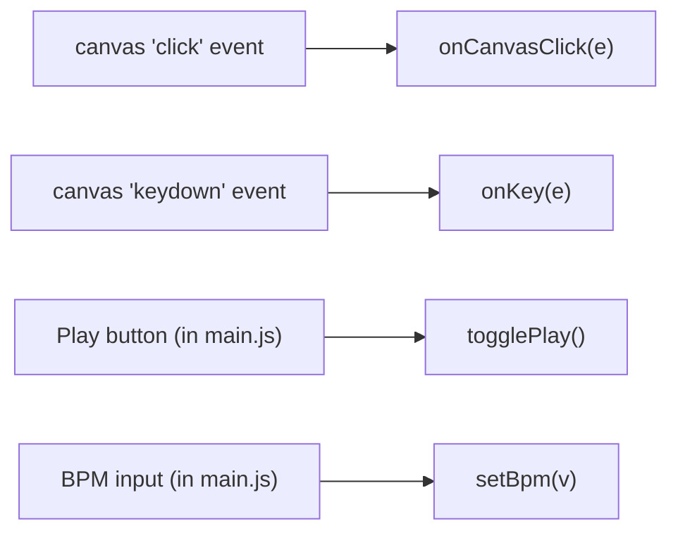
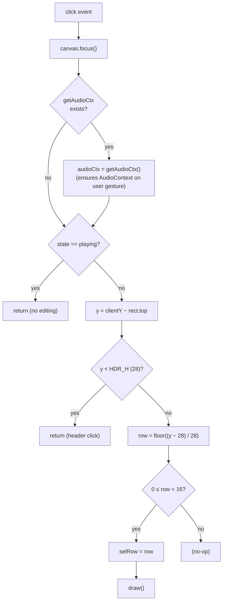
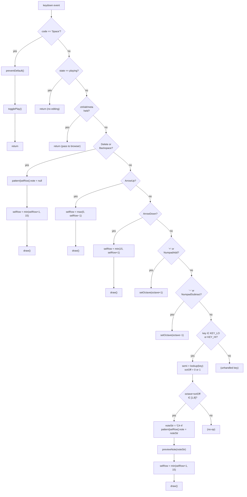

# Grid Editor — Input Handling

## Event Sources



Both event listeners are registered in `initGrid()`. The canvas has `tabIndex=0` so it can receive keyboard focus.

## onCanvasClick — Full Flow



## onKey — Complete Dispatch Tree



## FT2 Keyboard Layout

The note input maps physical keyboard positions to semitones, mimicking FastTracker 2:

```
┌─────────────────────────────────────────────────────────┐
│  UPPER ROW (KEY_HI) — octave + 1                       │
│                                                         │
│     2    3         5    6    7                           │
│   C# D#        F# G# A#                                │
│  Q    W    E    R    T    Y    U                        │
│  C    D    E    F    G    A    B                        │
│                                                         │
│  LOWER ROW (KEY_LO) — base octave                      │
│                                                         │
│     S    D         G    H    J                          │
│   C# D#        F# G# A#                                │
│  Z    X    C    V    B    N    M                        │
│  C    D    E    F    G    A    B                        │
└─────────────────────────────────────────────────────────┘
```

### Semitone Mapping Table

| Semitone | Name | KEY_LO | KEY_HI |
|----------|------|--------|--------|
| 0 | C | `z` | `q` |
| 1 | C# | `s` | `2` |
| 2 | D | `x` | `w` |
| 3 | D# | `d` | `3` |
| 4 | E | `c` | `e` |
| 5 | F | `v` | `r` |
| 6 | F# | `g` | `5` |
| 7 | G | `b` | `t` |
| 8 | G# | `h` | `6` |
| 9 | A | `n` | `y` |
| 10 | A# | `j` | `7` |
| 11 | B | `m` | `u` |

### Note String Construction

```
octOff = 0 (KEY_LO) or 1 (KEY_HI)
o = octave + octOff
noteStr = SEM_NAMES[semi] + "-" + o

Example: octave=4, press 't' (KEY_HI, semi=7=G)
  → o = 4+1 = 5
  → noteStr = "G-5"
```

## Side Effects Summary

| Input | Mutates | Calls | Fires onChange? |
|-------|---------|-------|-----------------|
| Click row | `selRow` | `draw()` | No |
| Space | FSM state | `togglePlay()` → `startPlay/stopPlay` | Yes |
| Arrow Up/Down | `selRow` | `draw()` | No |
| Delete/Backspace | `pattern[selRow].note`, `selRow` | `draw()` | No |
| Note key | `pattern[selRow].note`, `selRow` | `previewNote()`, `draw()` | No |
| +/− | `octave` | `setOctave()` | Yes (via `setOctave`) |

### Note: Missing onChange Calls

Currently, editing notes (entering/deleting) does **not** call `fireChange()`. Only `togglePlay()` and `setOctave()` do. If you add features that depend on `onChange` for pattern edits, you'll need to add `fireChange()` calls to the note input and delete handlers.
